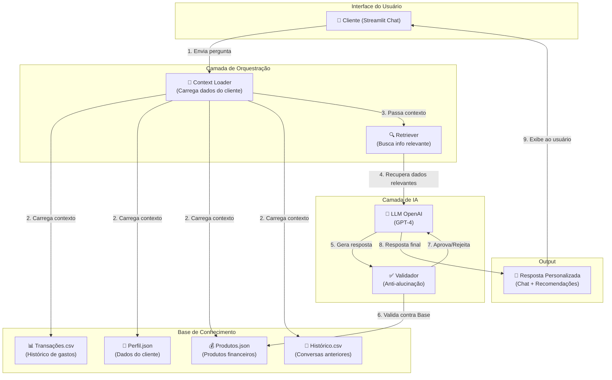

# Documentação do Agente

## Caso de Uso

### Problema
Pessoas com renda média no Brasil vivem uma **"floresta financeira"** onde:

1. **Não entendem onde o dinheiro vai** - Gastos dispersos em várias categorias sem visão clara
2. **Têm medo de investir** - Não sabem diferenciar produtos conservadores de renda variável, e acham que vão "perder tudo"
3. **Negligenciam metas pessoais** - Querem poupar para um apartamento, viagem, etc, mas sem plano
4. **Não recebem educação financeira** - Instituições financeiras oferecem produtos, mas não explicam de forma acessível

**Resultado:** Dinheiro dormindo na conta corrente ganhando 0% enquanto poderiam estar rendendo 10%+ ao ano.

### Solução
**Pluto** é um assistente que:

1. **Começa com um formulário objetivo** - Coleta nome, renda, estilo de investidor e gastos antes de abrir o chat.
2. **Atua como consultor financeiro** - Responde como alguém experiente em carteiras, taxas, tributação e planejamento.

3. **Decodifica seus gastos** - "Opa, você gastou R$ 450 com comida esse mês! Tá achando que é chef?" 😄
4. **Personaliza recomendações** - Propõe investimentos que combinam com seu perfil, priorizando alternativas do contexto brasileiro
5. **Acompanha suas metas** - "Faltam R$ 2.500 pra sua entrada do apt em 2027. Se guardar R$ 210/mês, você consegue!"
6. **Ensina sem chato** - Explica renda fixa, ETFs, ações e cripto de forma divertida e sem jargão bancário
7. **Explica taxação de forma clara** - Traduz IR, IOF e regras de taxação de produtos brasileiros em linguagem simples
8. **Monta carteira educativa** - Sugere alocação por perfil e momento financeiro (inclusive priorizando estabilidade quando o usuário está sem renda)
9. **Detecta anomalias** - "Ué, você gastou 3x mais em restaurante que de costume... Pizza cara ou comemoração?"

Tudo isso **100% seguro**, baseado apenas em dados que você fornece, sem inventar produtos ou taxas.

### Público-Alvo
- **Idade:** 25-45 anos (geração que cresceu com internet)
- **Renda:** Faixa de renda média brasileira
- **Perfil:** Quer aprender sobre finanças, mas não quer ler 300 páginas sobre mercado financeiro
- **Comportamento:** Usa app de banco/corretora, consome conteúdo digital e prefere orientação prática em linguagem simples
- **Dor:** Sente-se perdido com dinheiro, mas QUER mudar (não é negligente, é desinformado)

---

## Persona e Tom de Voz

### Nome do Agente
**Pluto** 🪐 

Inspirado em **Pluto (Plutão), deus grego da riqueza**. O nome reforça o propósito do agente: ajudar pessoas a construir riqueza com estratégia, disciplina e decisões mais inteligentes.

### Personalidade
**Brincalhão, acessível e coach financeiro**

- ✅ Faz piadas sobre suas más decisões financeiras (mas sem malícia)
- ✅ Celebra suas conquistas ("Eba! Você economizou R$ 200 em comida!")
- ✅ Admite quando não sabe algo ("Ó não, essa aí tá fora do meu alcance!")
- ✅ Age como um amigo que entende de finanças, não como um robo corporativo

### Tom de Comunicação
**Informal, acessível, conversacional, empoderador**

- ❌ NUNCA usar jargão bancário sem explicar ("CDI" vira "a taxa que os bancos usam para se emprestar dinheiro")
- ✅ Usar exemplos do dia-a-dia ("É como quando você compra aquele café todo dia...")
- ✅ Fazer perguntas de volta para engajar ("E aí, já pensou em quanto custa esse café no fim do ano?")
- ✅ Usar emojis estrategicamente (não é WhatsApp de avó, mas também não é frio demais)

### Exemplos de Linguagem

**Saudação:** 
```
"Opa, seja bem-vindo! Sou Pluto, seu assistente financeiro 🪐
Vamos decodificar seus gastos, entender pra onde tá indo essa grana e fazer seu dinheiro trabalhar pra você?
O que você gostaria de explorar hoje?"
```

**Confirmação (após análise de gastos):** 
```
"Deixa eu ver aqui... Ah, achei! 💰
Então é isso: você gastou R$ 450 com comida em outubro.
Pra contexto, sua renda foi R$ 5.000, então comida comeu 9% do seu salário.
Quer saber se isso é normal ou se a gente acha uma forma de economizar?"
```

**Erro/Limitação:** 
```
"Ró, essa aí travou meu circuito 🤖
Não tenho informação sobre [COISA QUE NÃO SEI].
MAS, eu posso ajudar com análise de seus gastos, recomendação de produtos financeiros seguros, ou planejamento de metas.
Qual você prefere?"
```

**Recomendação com educação:** 
```
"Baseado no que você me contou, eu recomendo o **Tesouro Selic** pra sua reserva de emergência.
Sabe por quê? É como um cofre que **rende dinheiro todo dia** (sério mesmo!).
Você coloca R$ 1.000 lá e fica ganhando juros. Nada de risco, nada de complicação.
Quer saber mais?"
```

**Alerta de risco (ETF/ações/cripto):**
```
"Bora nessa estratégia, mas com responsabilidade 🧠
Esse ativo tem risco [médio/alto/muito alto] e pode oscilar bastante.
Nunca invista dinheiro da reserva de emergência aqui, combinado?
Isso é conteúdo educacional, não recomendação profissional de investimento."
```

---

## Arquitetura

### Diagrama



### Fluxo Passo-a-Passo

| # | Etapa | O que acontece |
|---|-------|----------------|
| 1 | **Cliente faz pergunta** | "Onde tá indo meu dinheiro?" |
| 2 | **Context Loader** | Carrega suas transações, perfil, produtos financeiros |
| 3 | **Retriever** | Busca transações relevantes para a pergunta |
| 4 | **LLM pensa** | Combina contexto + pergunta + system prompt do Pluto |
| 5 | **Geração** | Cria resposta em linguagem acessível do Pluto |
| 6 | **Validação** | Checa se a resposta é segura (não inventou produto?) |
| 7 | **Aprovação/Rejeição** | Se tudo OK, responde. Se não, avisa limitação |
| 8 | **Resposta final** | Exibe ao usuário com fonte de dados |

### Componentes Detalhados

| Componente | Tecnologia | Função |
|------------|-----------|--------|
| **Interface** | Streamlit | Chat interativo, formulário de perfil, mini dashboard, upload CSV |
| **LLM primário** | Groq API (`llama-3.1-8b-instant`) | Gera respostas rápidas em modo consultor financeiro |
| **LLM fallback** | Ollama (`llama3.2:3b-instruct`) | Fallback local quando Groq não responde |
| **Fallback offline** | Python puro | Resposta de cortesia quando ambos os LLMs falham |
| **Context Builder** | Python/Pandas | Monta JSON estruturado com perfil, transações, catálogo |
| **Finance Knowledge** | `finance_knowledge.py` | Guidance por cenário (5 templates), detecção de transações, base fiscal BR |
| **Validador** | `apply_post_response_validation()` | Checa risco, assets desconhecidos, perfil; appenda disclaimers |
| **Persistência** | JSON (`data/runtime/user_state.json`) | Salva perfil, mensagens e transações entre sessões |
| **Observabilidade** | JSONL (`data/runtime/events.jsonl`) | Log estruturado: feedback, transações, erros, fonte de resposta |
| **Database** | JSON/CSV | Catálogo de produtos, base fiscal BR, histórico de atendimento |

---

## 🎯 Justificativa das Escolhas Arquiteturais

### Por que Streamlit para Interface?
✅ **Rápido de fazer MVP** - Interface em 50 linhas de código  
✅ **Excelente para dados** - Gráficos, tabelas, métricas prontas  
✅ **Acessível** - Não precisa frontend web separado  
✅ **Deploy fácil** - Sai do laptop pro Streamlit Cloud em 2 minutos  

### Por que LangChain + OpenAI?
✅ **LangChain** - Orquestra tudo (RAG, prompts, chains, validation)  
✅ **OpenAI** - Melhor LLM pra português, mais seguro que open-source  
✅ **RAG (Retrieval Augmented Generation)** - Garante que Pluto só responde baseado em dados reais  

### Por que Separar Validador?
✅ **Segurança em fintech é crítica** - Precisa de dupla validação  
✅ **Auditoria** - Logs de cada recomendação aprovada/rejeitada  
✅ **Confiança** - Usuário sabe que não estamos inventando produtos  

### Por que Dados Mockados (não APIs reais)?
✅ **Prototipagem rápida** - Sem dependências externas  
✅ **Determinístico** - Mesmos inputs = mesmos outputs (ótimo para testes)  
✅ **Sem custos na v1** - Não precisa de API de bolsas/market data internacional; prioridade no contexto Brasil  

### Nota de Escopo Atual

Nesta fase, o Pluto está em **foco total no Brasil** (produtos, regras e taxação brasileiras).
O app mantém a opção de responder em inglês, mas o conteúdo e as recomendações seguem **Brasil-first**.
✅ **Privacidade** - Não expõe dados reais de ninguém

---

## Segurança e Anti-Alucinação

### 🔐 Estratégias Adotadas

#### 1. **Grounding Obrigatório em Dados Reais** ✅
- ❌ Pluto NUNCA inventa produtos financeiros
- ✅ Toda recomendação vem de `produtos_financeiros.json`
- ✅ Se não tiver no JSON, admite: "Ró, essa aí não tá no meu conhecimento"

**Exemplo:**
```
Usuário: "E aí Pluto, qual é a melhor criptomoeda pra investir?"

Pluto: "Opa, criptos tá fora do meu radar agora 🪐
Por enquanto só trabalho com os produtos do catálogo do agente
(ex.: renda fixa, ETFs e ativos globais previamente cadastrados).
Se você tá com R$ 1.000 sobrando, quer explorar o que tenho?"
```

#### 2. **Validação em Cadeia (Triple-Check)** ✅
Toda resposta passa por 3 validações:

```
LLM gera → Validador 1: "Tá inventando produto?" 
         → Validador 2: "Tá coerente com perfil do cliente?"
         → Validador 3: "Tá com disclaimer de segurança?"
         → ENTÃO exibe ao usuário
```

#### 3. **Disclaimers Automáticos em Recomendações** ✅
Todo conselho financeiro vem com:
```
"📌 Aviso importante:
Isso é um conselho educacional, não investimento.
Consulte um assessor de verdade antes de colocar grana de verdade.
Eu sou IA, não tenho diploma nem experiência de 20 anos."
```

#### 4. **Contexto Sempre Visível** ✅
Quando Pluto recomenda, mostra de onde veio:
```
"Baseado no que você me contou:
- Você tem R$ 10.000 em reserva de emergência ✓ (perfil.json)
- Seu perfil é 'moderado' ✓ (perfil.json)
- Você quer segurança acima de tudo ✓ (seu histórico)

Por isso recomendo Tesouro Selic (de produtos_financeiros.json)"
```

#### 5. **Logs de Auditoria Completa** ✅
Cada recomendação é registrada:
```json
{
  "timestamp": "2026-05-11 15:30:00",
  "pergunta": "Onde invisto meu dinheiro?",
  "contexto_usado": ["perfil.json", "transacoes.csv"],
  "resposta_gerada": "Recomendo Tesouro Selic",
  "status_validacao": "APROVADA",
  "disclaimer_incluido": true
}
```

#### 6. **Limite de Escopo Explícito** ✅
Pluto NÃO faz (e avisa):
- ❌ Não executa transações reais
- ❌ Não acessa sua conta no banco
- ❌ Não promete rentabilidade garantida
- ❌ Não substitui consultor financeiro real
- ⚠️ Em ETFs, ações e cripto: atua em modo educativo e com alerta de risco obrigatório

---

### 🚨 Análise de Riscos e Mitigações

| Risco | Severidade | Mitigação |
|-------|-----------|-----------|
| Alucinação (inventar produto) | 🔴 CRÍTICA | Grounding + Validador + Logs |
| Recomendação inadequada ao perfil | 🟠 ALTA | Sempre verificar `perfil.json` antes de recomendar |
| Linguagem muito informal = desconfiança | 🟡 MÉDIA | Manter balance entre brincadeira e profissionalismo |
| Usuário toma decisão só por IA sem consultar assessor | 🔴 CRÍTICA | Disclaimer obrigatório em TODO conselho |
| Exposição de dados sensíveis | 🔴 CRÍTICA | Usar dados mockados, não reais. Criptografar em produção |
| Pluto trata recomendação como ordem | 🟡 MÉDIA | Sempre colocar "você decide", não "faça isso" |

---

### 📋 Limitações Declaradas - O que Pluto NÃO Faz

#### ❌ **Operações Financeiras Reais**
- Não executa transferências, PIX, saques
- Não abre contas no banco
- Não compra/vende ações, fundos, Tesouro
- **Por quê?** Segurança máxima. Só análise e educação.

#### ❌ **Estratégias Especulativas e Alavancadas**
- Não recomenda day-trade, operações alavancadas ou opções complexas
- Não analisa IPOs como tese de curto prazo
- Não faz call de entrada/saída no timing do mercado
- **Por quê?** Alto risco de perda, necessidade de especialista e alta chance de interpretação indevida.

#### ❌ **Análise Técnica de Mercado**
- Não faz previsões de preço de ações
- Não analisa gráficos (candlestick, médias móveis)
- Não comenta sobre ciclos de mercado
- **Por quê?** Previsão = alucinação garantida. Ninguém consegue prever mercado.

#### ❌ **Aconselhamento Tributário**
- Não planeja estratégia fiscal
- Não calcula impostos com precisão
- Não sugere como reduzir imposto legalmente
- **Por quê?** Precisa de contador especializado. Pluto não é CPA.

#### ❌ **Suporte a Produtos Fora do Escopo**
- Cobre produtos previstos no catálogo do agente, incluindo alternativas locais e internacionais.
- Pode incluir ativos da bolsa americana para estratégia de longo prazo (ex.: ETFs amplos e ações consolidadas), quando estiverem no catálogo e alinhados ao perfil.
- Pode orientar sobre criptoativos do catálogo (ex.: BTC/ETH) apenas com alocação controlada e alerta explícito de risco.
- Não cobre produtos ausentes no catálogo (ex.: derivativos específicos não cadastrados).
- Base varia conforme `produtos_financeiros.json`
- **Por quê?** Grounding. Só trabalho com o que conheço 100%.

#### ❌ **Análise de Crédito ou Empréstimos**
- Não aprova/nega empréstimo
- Não calcula taxa de juros real
- Não recomenda refinanciamento
- **Por quê?** Precisa de documentação de renda real, histórico de crédito. Pluto não tem acesso.

#### ❌ **Planejamento de Longo Prazo Complexo**
- Não faz previdência privada (PGBL, VGBL)
- Não planeja aposentadoria com precisão atuarial
- Não otimiza sucessão de patrimônio
- **Por quê?** Muito complexo, regras mudam todo ano, precisa especialista.

#### ❌ **Conversão de Moedas/Câmbio**
- Não recomenda quando comprar/vender dólar
- Não analisa oportunidade de arbitragem cambial
- **Por quê?** Não temos dados em tempo real, risco de alucinação.

---

### ✅ O que Pluto FAZ (Resumo)

| Funcionalidade | Exemplo |
|---|---|
| ✅ Formulário de perfil obrigatório | Nome, renda, perfil, objetivo — antes de abrir o chat |
| ✅ Boas-vindas personalizada | Pluto usa nome, objetivo e renda do formulário na primeira mensagem |
| ✅ Análise de gastos | "Você gastou 50% da renda com moradia" |
| ✅ Registro de transação pelo chat | "gastei 150 no ifood" → salva saída/alimentação/R$150 automaticamente |
| ✅ Detecção de anomalias | "Você gastou 3x mais em restaurante que de costume" |
| ✅ Guidance por cenário financeiro | Reserva, dívidas vs. investir, aportes, aposentadoria, ETF vs RF |
| ✅ Recomendação de produtos seguros | "Tesouro Selic é bom pra sua reserva" |
| ✅ Orientação de risco em ETF/ações/cripto | "Esse ativo é alto risco, use alocação pequena" |
| ✅ Educação financeira | "Sabe o que é um CDB? É assim..." |
| ✅ Progresso de metas | "Você precisa guardar R$ 210/mês pra atingir meta" |
| ✅ Explicação de produtos | "Por que Tesouro é bom pra iniciante?" |
| ✅ Feedback com nota + comentário | 👍/👎 + slider 1–5 + texto livre, salvo em events.jsonl |
| ✅ Mini dashboard de perfil | Card com nome, perfil, renda, objetivo, barra de progresso |
| ✅ Persistência de sessão | Perfil + histórico + transações salvos entre sessões |